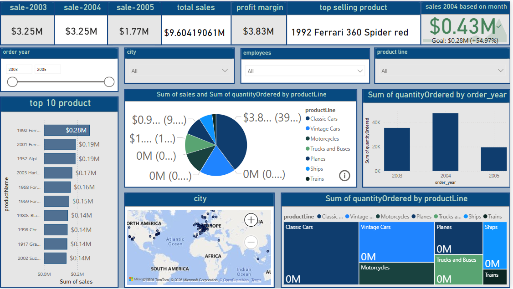

# Power_BI-Customer---employee-sales-
Power BI Dashboard Project: Customer, Employee, and Product Sales Analysis

This repository presents a Power BI project that analyzes customer behavior, employee contributions, and product sales performance across different categories and timelines.  
The dashboard is interactive, visually engaging, and supports detailed drill-through capabilities.

📊 Project Features

dashboard preview :

 1. Main Dashboard 
  - KPIs Displayed:  
  - Total Sales (2003-2005)
  - Profit Margin
  - Top Selling Product
  - Monthly Sales Performance (2004)

Interactive Filters:  
  - Year, City, Employee, Product Line
  
Visuals: 
  - Top 10 Products by Sales
  - Sales and Quantity by Product Line 
  - Sales Quantity by Order Year 
  - Geographical Sales Distribution 

2.Tooltip Page

- **Dynamic Tooltip: 
  - Appears when hovering over visuals in the main dashboard.
  - Displays **Sum of Quantity Ordered by Order Year**.
  - Helps users gain instant drill-down without navigating away.

3.Detail Page 

- Detailed Insights:  
  - Activated via the information icon in the main dashboard.
  - Shows:
    - Sum of Sales by Product Line
    - Sum of Quantity Ordered by Product Line
    - Sum of Sales and Quantity Ordered by Product Name
    - Sales Trends over Days

File

- 'CUS-EMP sales.pbix' – Main Power BI report file

How to Use

1. Clone or download this repository.
2. Open `CUS-EMP sales.pbix` in Power BI Desktop.
3. Click "Refresh" to load your data (Home > Refresh).
4. Interact with visuals and slicers to explore different insights.

🛠 Tools Used
- Power BI Desktop (Visualization & Dashboard Building)
- Excel/CSV (Data Source Preparation)
- Git & GitHub (Version Control and Sharing).

author
Archi Dholiya 
archi1715
